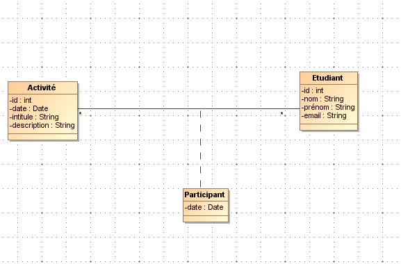
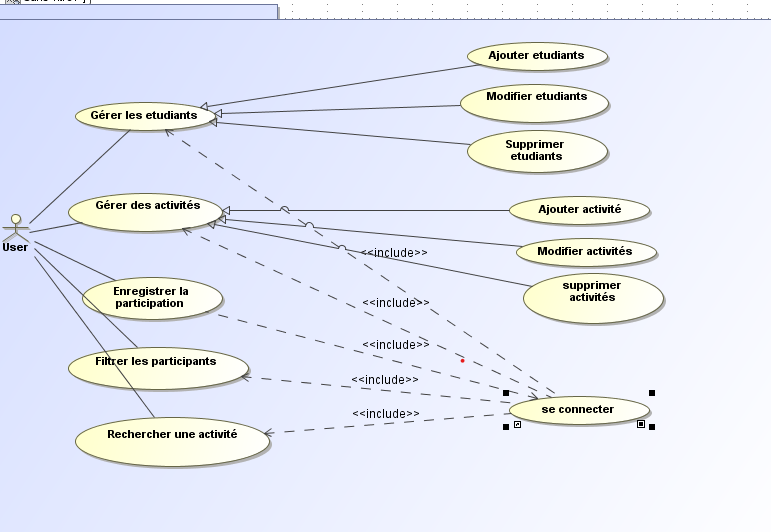
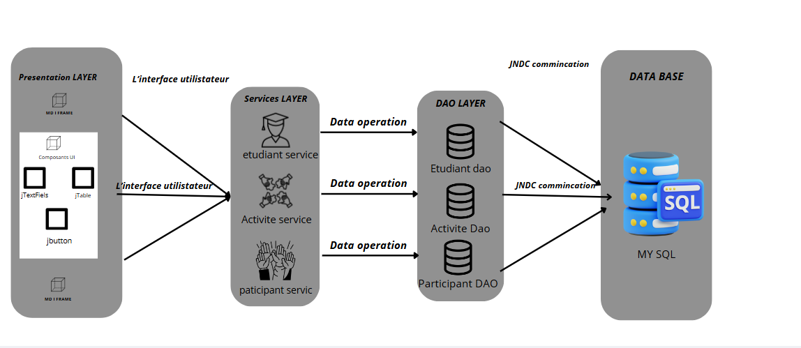

# Gestion des Activités Pédagogiques 


## 📚 Description
Un système complet pour organiser, suivre et analyser les activités pédagogiques et la participation des étudiants.

## � Objectifs
- Organiser les activités académiques
- Suivre la participation des étudiants
- Générer des statistiques d'engagement
- Faciliter la prise de décision pédagogique

---

## 🗃️ Structure de la Base de Données

### Tables Principales
| Table                 | Champs                          |
|-----------------------|---------------------------------|
| `Activité`            | id, intitule, date, description|
| `Étudiant`            | id, nom, prénom, email         |
| `ParticipationActivité`| activité_id, etudiant_id       |
| `User`                | login, password, email         |

---

## ⚙️ Fonctionnalités
- Création d'activités pédagogiques
- Inscription des étudiants aux activités
- Filtrage des participants par activité
- Recherche avancée d'activités
- Authentification sécurisée des utilisateurs
- Réinitialisation de mot de passe par email

---

## 🖼️ Diagrammes

### Diagramme de Classe


### Diagramme d'Utilisation


---
### 📺Vidéo démonstraton


https://github.com/user-attachments/assets/8dc3c63c-c176-4658-9542-46b5ed6389e1


## 🏛️ Architecture du Système

### **Diagramme d'Architecture**



### **Description de l'Architecture**
Le système est basé sur une architecture **client-serveur** avec les composants suivants :
1. **Frontend** : L'interface utilisateur est développée en Java Swing, permettant une interaction intuitive avec les utilisateurs.
2. **Backend** : La logique métier et la gestion des données sont gérées par une base de données MySQL, accessible via JDBC.
3. **Base de Données** : Les données sont stockées dans des tables relationnelles (Activité, Étudiant, ParticipationActivité, User).
4. **Authentification** : Un système sécurisé de connexion et de réinitialisation de mot de passe est implémenté.

---

## 🛠️ Technologies

### **Frontend**
- **Java Swing** : Interface graphique pour une expérience utilisateur fluide.
- **Icons8** : Bibliothèque d'icônes pour une interface visuellement attrayante.

### **Backend**
- **MySQL** : Base de données relationnelle pour stocker les données.
- **JDBC** : Connexion entre l'application Java et la base de données.

### **Outils**
- **NetBeans** : Environnement de développement intégré (IDE) pour le développement Java.
- **StarUML** : Outil de modélisation pour les diagrammes UML.
- **phpMyAdmin** : Interface web pour la gestion de la base de données MySQL.

---

## 🗄️ Code SQL

```sql
-- Création de la table Activité
CREATE TABLE Activité (
    id INT AUTO_INCREMENT PRIMARY KEY,
    intitule VARCHAR(255) NOT NULL,
    date DATE NOT NULL,
    description TEXT
);

-- Création de la table Étudiant
CREATE TABLE Étudiant (
    id INT AUTO_INCREMENT PRIMARY KEY,
    nom VARCHAR(100) NOT NULL,
    prénom VARCHAR(100) NOT NULL,
    email VARCHAR(255) NOT NULL UNIQUE
);

-- Table de liaison ParticipationActivité
CREATE TABLE ParticipationActivité (
    activité_id INT NOT NULL,
    etudiant_id INT NOT NULL,
    FOREIGN KEY (activité_id) REFERENCES Activité(id) ON DELETE CASCADE,
    FOREIGN KEY (etudiant_id) REFERENCES Étudiant(id) ON DELETE CASCADE
);

-- Table d'authentification
CREATE TABLE User (
    login VARCHAR(100) PRIMARY KEY,
    password VARCHAR(150) NOT NULL,
    securityQuestion VARCHAR(255),
    securityAnswer VARCHAR(255),
    email VARCHAR(255);
)
